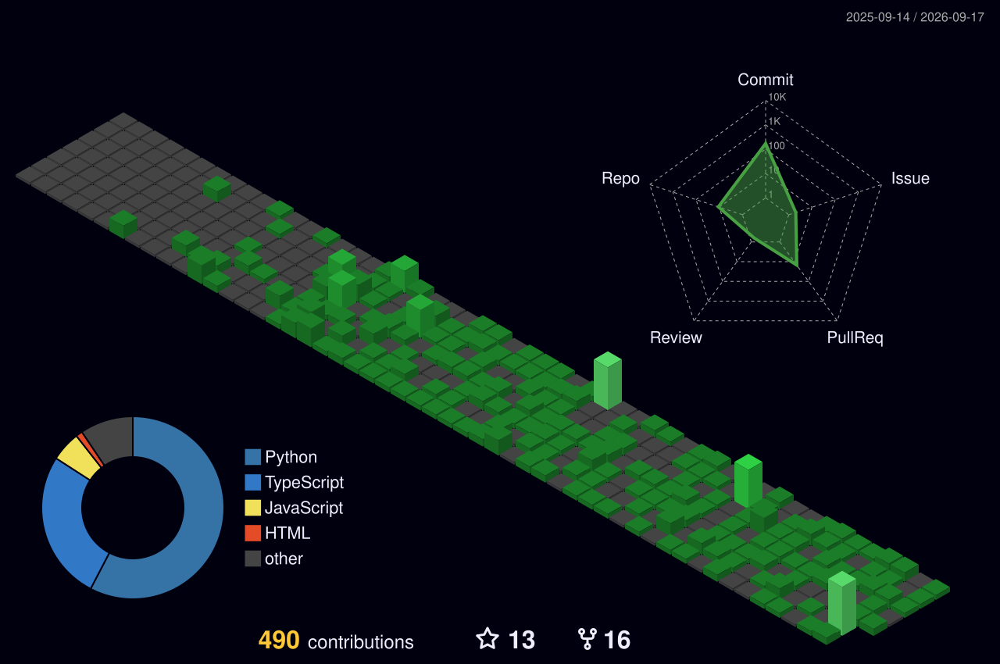

<!-- Profile Banner -->

  

<!-- Intro -->
<h1 align="center">👋 Hi, I'm Harsh Shah</h1>
<h3 align="center">Designing seamless experiences through code & creativity</h3>

<!-- Badges / Links -->

  
  
  

---

### 🌟 About Me
I'm a **Software Engineer** passionate about creating impactful digital experiences — from intuitive frontends to robust backend systems.  
Currently pursuing my **MS in Computer Science at Stony Brook University**, I’ve built products that blend **aesthetic design** and **engineering precision**.

💡 I love working on:
- Scalable full-stack applications  
- Data-driven and AI-powered tools  
- Blockchain and security research  
- Clean, modern UI/UX systems  

---

### 🛠️ Tech Stack

  

---

### 🚀 Featured Projects
- 🧠 **HealthSynopsis** – AI-enhanced medical summarization using LSTMs & LLMs  
- 🦾 **SpotiFind Inspiration** – Multimodal accessibility app that won *HopperHacks 2025*
- 🌍 **Virtual Street Explorer** – Gesture-controlled navigation through Google Street View

---

  

---

### 🧭 Let’s Connect

  <a href="https://harsh.software" target="_blank">🌐 harsh.software</a> •
  <a href="mailto:harsh@harsh.software">✉️ harsh@harsh.software</a> •
  <a href="https://linkedin.com/in/harsh-h-shah">💼 LinkedIn</a>

---

  <i>“Design meets logic — that’s where the best software lives.”</i>

